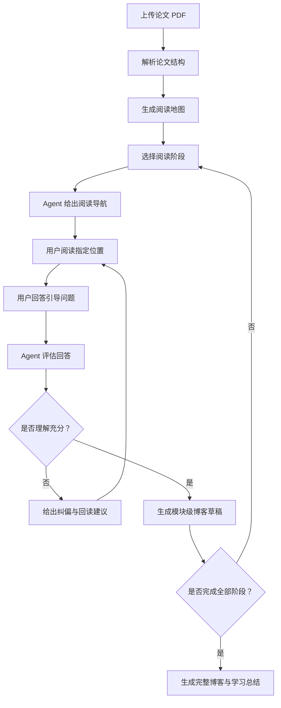
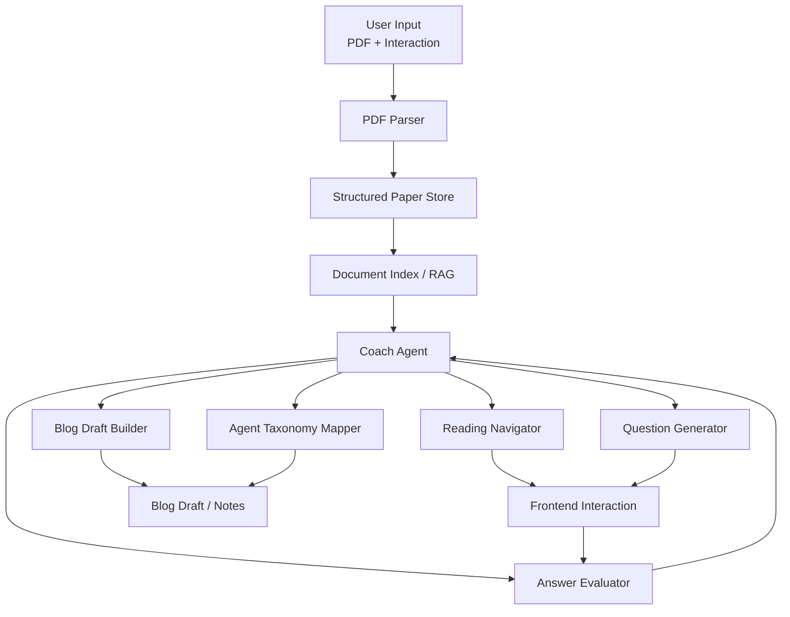

# PaperCoach

**A Socratic LLM Agent for Guided Research Paper Understanding**

---

## 1. 项目简介

PaperCoach 是一个面向科研学习场景的论文精读 Agent 系统，旨在解决传统 LLM 只能“总结论文”，但无法“帮助用户真正理解论文”的问题。

不同于常见的 PDF 问答或论文摘要工具，PaperCoach 通过 **分阶段阅读导航、苏格拉底式提问、用户回答反馈、博客结构化生成**，引导用户主动参与论文理解过程，从“被动接收总结”转变为“主动构建认知”。

项目核心目标是探索：

> 如何利用 LLM + Agent 机制，构建一个能够提升人类理解复杂论文能力的学习辅助系统。

---

## 2. 背景与问题

### 2.1 传统论文阅读痛点

在阅读 AI / Agent / LLM 相关论文时，常见问题包括：

- 无法快速判断论文是否值得深入阅读。
- 读完后抓不住论文的核心贡献。
- 方法部分难以理解，尤其是复杂推理流程、系统架构或实验设计。
- 无法建立论文之间的知识联系。
- 很难将理解转化为结构化笔记、技术博客或复盘材料。

### 2.2 现有工具的局限

当前主流工具，如 ChatPDF、PDF QA、GPT Summarizer，通常存在以下问题：

- 直接生成总结，用户被动接受。
- 缺乏阅读路径引导，用户不知道应该先读哪里。
- 提问不基于论文证据，缺少 section、figure、table 定位。
- 无法评估用户理解是否正确。
- 不支持系统性知识沉淀，例如博客、知识卡片或研究笔记。

### 2.3 核心研究问题

PaperCoach 试图探索：

> 如何通过 Agent 机制，引导用户主动阅读、回答问题，并在反馈循环中逐步深化理解？

---

## 3. 核心思路

PaperCoach 的核心思想是：

> 将论文阅读过程转化为一个“可引导、可交互、可反馈”的认知过程，而不是一次性信息获取。

系统不直接替用户完成理解，而是设计一个有状态的阅读流程，让用户在 Agent 的引导下完成阅读、回答、纠偏、总结和输出。

### 3.1 分阶段阅读流程

系统将论文理解拆解为多个阶段：

- Background
- Problem
- Key Idea
- Architecture
- Method
- Experiments
- Results
- Limitations
- Thoughts

每一阶段单独推进，避免一次性总结导致的信息过载。

### 3.2 阅读导航

在每一轮交互中，Agent 会明确指导用户：

- 应该先读论文哪一部分，例如 section、figure、table。
- 本轮阅读目标是什么。
- 应该重点关注哪些信息。
- 读完后需要回答哪些问题。

### 3.3 苏格拉底式提问

Agent 不直接给出完整答案，而是提出问题引导用户思考，例如：

- 作者认为现有方法的主要不足是什么？
- 该方法的核心创新点在哪里？
- 哪个实验最能支撑论文的核心 claim？
- 该方法的设计是否真的解决了作者提出的问题？

### 3.4 用户回答反馈机制

用户回答后，系统进行结构化评估：

- 准确性
- 完整性
- 深度
- 表达质量
- 证据引用情况

反馈内容包括：

- 回答中的亮点。
- 需要修正的地方。
- 理解补充。
- 建议回读的位置。
- 可以继续深入的问题。

### 3.5 博客结构化生成

在每个模块完成后，系统生成可用于技术博客的内容草稿，并区分：

- 论文事实。
- 用户理解。
- 用户评价。
- 延伸思考。

最终目标不是生成一篇泛泛的摘要，而是沉淀一篇能够体现用户理解过程的研究型技术博客。

---

## 4. 用户流程



---

## 5. 系统架构

整体系统采用模块化 Agent 架构：



---

## 6. 核心模块设计

### 6.1 PDF Parser

职责：

- 提取论文基础信息：
  - Title
  - Authors
  - Abstract
  - Sections
  - Figures
  - Tables
  - References
- 建立 section-level 和 paragraph-level 索引。
- 为后续 RAG 检索提供结构化输入。

可选技术：

- PyMuPDF
- GROBID
- Unstructured
- LlamaParse

输出示例：

```json
{
  "paper_id": "paper_001",
  "title": "Example Paper",
  "abstract": "...",
  "sections": [
    {
      "id": "sec_1",
      "title": "Introduction",
      "page_start": 1,
      "page_end": 2,
      "content": "..."
    }
  ],
  "figures": [
    {
      "id": "fig_1",
      "caption": "...",
      "page": 3
    }
  ]
}
```

### 6.2 Reading Navigator

职责：

- 根据当前阅读阶段，选择合适的论文位置。
- 给出明确阅读目标。
- 约束用户本轮阅读范围，降低阅读成本。
- 确保后续问题绑定论文证据。

输出模板：

```markdown
## 本轮阅读导航

**建议先读：**
Introduction 第 2-4 段，以及 Figure 1。

**阅读目标：**
理解作者认为现有方法存在什么问题，以及本文希望解决什么核心矛盾。

**重点关注：**
- 作者如何描述现有方法的不足。
- 这些不足是否与本文方法设计直接相关。
- Figure 1 是否展示了本文方法与已有方法的差异。

**读完后回来回答：**
1. 作者认为现有方法的主要问题是什么？
2. 本文试图解决的问题和传统任务有什么不同？
3. Figure 1 想表达的核心信息是什么？
```

### 6.3 Question Generator

职责：

- 每轮生成 3 到 5 个问题。
- 问题必须绑定论文位置。
- 问题层次递进：
  - 事实理解
  - 机制理解
  - 贡献判断
  - 批判评价
  - 延伸思考

问题示例：

```markdown
1. 回到 Introduction 第 2-4 段，作者如何描述现有 Agent 方法的不足？
2. 从 Method 第 3.1 节看，本文方法的核心机制是什么？
3. 哪个实验最能支撑作者的核心 claim？为什么？
4. 你认为这个方法的局限主要来自任务设定、模型能力，还是实验设计？
```

### 6.4 Answer Evaluator

职责：

- 评估用户回答是否准确。
- 判断回答是否覆盖关键证据。
- 发现误解、遗漏和表达模糊处。
- 给出可执行的回读建议。

输出模板：

```markdown
## 回答反馈

### 1. 你回答中的亮点

- ...

### 2. 需要修正的地方

- ...

### 3. 建议回读的位置

- ...

### 4. 可以继续挖深的问题

- ...
```

评估维度：

| 维度 | 说明 |
|------|------|
| Accuracy | 是否符合论文原文 |
| Completeness | 是否覆盖关键点 |
| Evidence | 是否引用了论文位置 |
| Depth | 是否能解释原因与机制 |
| Expression | 是否表达清晰 |

### 6.5 Blog Draft Builder

职责：

- 将用户回答和 Agent 反馈整理成博客草稿。
- 保留用户自己的理解与评价。
- 对技术表达进行增强。
- 按模块逐步生成，而不是一次性代写整篇。

输出结构：

```markdown
## Background

### 论文事实

...

### 我的理解

...

### 值得注意的问题

...
```

### 6.6 Agent Taxonomy Mapper

职责：

将论文归类到 Agent 研究方向中，帮助用户建立研究地图。

分类标签：

- Planning / Reasoning
- Memory
- Tool Use
- Reflection
- Multi-Agent
- Evaluation
- Workflow Design
- Human-Agent Interaction
- Agent Safety

分析维度：

- 论文主要提升的是认知能力还是执行能力。
- 论文属于方法创新、系统工程、评测框架还是应用探索。
- 该论文和已有 Agent 工作之间的关系。
- 该论文适合作为哪些研究问题的参考文献。

---

## 7. Agent 状态设计

PaperCoach 需要维护用户在单篇论文中的阅读状态。

```json
{
  "session_id": "session_001",
  "paper_id": "paper_001",
  "current_stage": "Problem",
  "completed_stages": ["Background"],
  "reading_targets": [
    {
      "type": "section",
      "id": "sec_1",
      "title": "Introduction"
    }
  ],
  "user_answers": [
    {
      "question_id": "q_001",
      "answer": "...",
      "score": {
        "accuracy": 4,
        "completeness": 3,
        "depth": 3
      }
    }
  ],
  "blog_fragments": [
    {
      "stage": "Background",
      "content": "..."
    }
  ]
}
```

---

## 8. 技术栈

| 模块 | 推荐技术 |
|------|----------|
| 前端 | Next.js / React / Tailwind CSS |
| 后端 | FastAPI / Node.js |
| LLM | OpenAI GPT / Claude / Qwen |
| RAG 框架 | LlamaIndex / LangChain |
| 向量数据库 | pgvector / FAISS / Chroma |
| PDF 解析 | PyMuPDF / GROBID |
| Agent 编排 | LangGraph |
| 数据库 | PostgreSQL / SQLite |
| 文件存储 | Local FS / S3-compatible Storage |

推荐 MVP 技术组合：

- 前端：Next.js
- 后端：FastAPI
- PDF 解析：PyMuPDF
- 向量检索：FAISS
- Agent 编排：LangGraph
- 数据存储：SQLite 或 PostgreSQL

---

## 9. MVP 范围

第一版不追求功能完整，而是验证核心闭环：

> 上传论文 → 解析结构 → 分阶段导航 → 用户回答 → Agent 反馈 → 生成博客片段。

### 9.1 必做功能

- PDF 上传。
- 论文标题、摘要、章节提取。
- 章节级 RAG 检索。
- 固定阅读阶段流程。
- 每阶段生成阅读导航。
- 每阶段生成 3 到 5 个引导问题。
- 用户提交回答。
- Agent 评估回答。
- 生成模块级博客草稿。

### 9.2 暂缓功能

- 多论文对比。
- 自动知识图谱。
- 用户长期学习画像。
- 多 Agent 协作。
- 精细 figure / table 图像理解。
- 复杂权限与团队协作。

---

## 10. API 草案

### 10.1 上传论文

```http
POST /api/papers
Content-Type: multipart/form-data
```

返回：

```json
{
  "paper_id": "paper_001",
  "title": "Example Paper",
  "status": "parsed"
}
```

### 10.2 获取阅读导航

```http
POST /api/sessions/{session_id}/navigation
```

请求：

```json
{
  "stage": "Problem"
}
```

返回：

```json
{
  "stage": "Problem",
  "reading_targets": ["Introduction 第 2-4 段"],
  "goal": "...",
  "questions": [
    {
      "id": "q_001",
      "question": "...",
      "evidence_location": "Introduction 第 2 段"
    }
  ]
}
```

### 10.3 提交回答并获取反馈

```http
POST /api/sessions/{session_id}/answers
```

请求：

```json
{
  "question_id": "q_001",
  "answer": "..."
}
```

返回：

```json
{
  "feedback": "...",
  "scores": {
    "accuracy": 4,
    "completeness": 3,
    "depth": 3,
    "evidence": 2
  },
  "reread_suggestions": ["Introduction 第 3 段"]
}
```

### 10.4 生成博客片段

```http
POST /api/sessions/{session_id}/blog-fragments
```

请求：

```json
{
  "stage": "Problem"
}
```

返回：

```json
{
  "stage": "Problem",
  "content": "..."
}
```

---

## 11. 推荐目录结构

```text
papercoach/
  apps/
    web/
      src/
        app/
        components/
        lib/
    api/
      app/
        main.py
        routers/
        services/
        agents/
        schemas/
        storage/
  packages/
    prompts/
      reading_navigator.md
      question_generator.md
      answer_evaluator.md
      blog_draft_builder.md
    shared/
  data/
    papers/
    indexes/
  docs/
    PaperCoach.md
    api.md
    prompts.md
  README.md
```

---

## 12. Prompt 设计原则

### 12.1 Reading Navigator Prompt

目标：

- 不直接总结整篇论文。
- 只给出本轮阅读范围。
- 明确阅读目标和问题。
- 必须引用论文位置。

约束：

- 每轮最多推荐 1 到 2 个 section 或 figure。
- 不要让用户一次读太多内容。
- 不要提前透露完整答案。

### 12.2 Question Generator Prompt

目标：

- 生成能够推动理解的问题。
- 问题从事实理解逐步过渡到批判性评价。
- 每个问题必须绑定证据位置。

约束：

- 不生成泛泛的问题。
- 不问论文中没有依据的问题。
- 不要求用户凭空评价。

### 12.3 Answer Evaluator Prompt

目标：

- 判断用户理解是否准确。
- 给出纠偏和补充。
- 推荐具体回读位置。

约束：

- 不简单打分。
- 不直接替用户重写全部答案。
- 反馈应具体、可执行、基于论文证据。

---

## 13. 项目亮点

### 13.1 从总结工具到学习系统

PaperCoach 的重点不是生成答案，而是引导用户完成理解过程。

### 13.2 有状态阅读流程

系统支持多阶段论文拆解，而不是单轮问答。

### 13.3 证据驱动提问

问题绑定论文 section、figure、table，减少幻觉和泛泛而谈。

### 13.4 用户参与式学习

用户必须回答问题，Agent 再根据回答进行评估和反馈。

### 13.5 面向输出的设计

最终产物是高质量技术博客、研究笔记或汇报材料，而不是聊天记录。

---

## 14. 初步实验设计

后续可以设计一个小规模实验验证效果。

### 14.1 对比设置

- Baseline A：用户直接阅读论文。
- Baseline B：用户使用普通 LLM 总结。
- PaperCoach：用户使用分阶段阅读导航和反馈机制。

### 14.2 观察指标

- 用户能否准确说出论文问题、方法、实验和局限。
- 用户回答中引用论文证据的比例。
- 用户对核心贡献的理解深度。
- 用户最终生成博客的结构完整性。
- 用户主观阅读负担。

### 14.3 可能结论

- Socratic prompting 有助于提升主动理解。
- 分阶段阅读比一次性总结更适合复杂论文学习。
- 证据绑定可以降低幻觉并提升回答质量。

---

## 15. 开发路线

### Phase 0：项目初始化

- 初始化 Git 仓库。
- 搭建前后端基础结构。
- 确定 PDF 解析和向量检索方案。
- 编写核心 prompt 初稿。

### Phase 1：论文解析与索引

- 支持 PDF 上传。
- 提取标题、摘要和章节。
- 构建 chunk 和 embedding。
- 实现 section-level 检索。

### Phase 2：阅读导航闭环

- 实现阅读阶段状态机。
- 实现 Reading Navigator。
- 实现 Question Generator。
- 在前端展示本轮阅读任务和问题。

### Phase 3：回答评估闭环

- 实现用户回答提交。
- 实现 Answer Evaluator。
- 保存每轮回答、反馈和评分。
- 支持回读建议。

### Phase 4：博客生成

- 实现模块级博客草稿生成。
- 支持编辑、合并和导出 Markdown。
- 区分论文事实、用户理解和延伸思考。

### Phase 5：增强功能

- 支持 Agent Taxonomy Mapper。
- 支持论文对比分析。
- 支持知识图谱。
- 支持多 Agent 协作。

---

## 16. 未来工作

- 引入多 Agent 协作，例如 Reviewer、Critic、Tutor。
- 支持论文对比分析。
- 自动生成研究方向知识图谱。
- 加入实验设计评估模块。
- 建立用户学习轨迹模型。
- 支持课程、组会和导师讨论场景。

---

## 17. 项目意义

PaperCoach 不仅是一个论文工具，更是对以下问题的探索：

> LLM Agent 是否可以作为“认知增强系统”，帮助人类理解复杂知识？

该项目可以服务于：

- AI 教育辅助系统。
- Human-AI 协同学习。
- Agent 交互设计。
- 科研训练与论文精读。

---

## 18. Reflection

在实现 PaperCoach 的过程中，可以重点思考：

- LLM 不只是信息生成工具，更可以作为认知引导工具。
- 用户参与是理解的关键，而不是自动总结。
- Agent 的核心不只在于调用工具，也在于设计可持续推进的交互流程。
- 好的 Agent 系统应该让用户变得更会思考，而不是只是更快拿到答案。

这使得 PaperCoach 的价值不仅在于完成一个工具 Demo，也在于体现对 Agent 系统设计和 Human-AI Interaction 的理解。

---

## 19. 项目地址

- GitHub：待填写
- Demo：待填写

